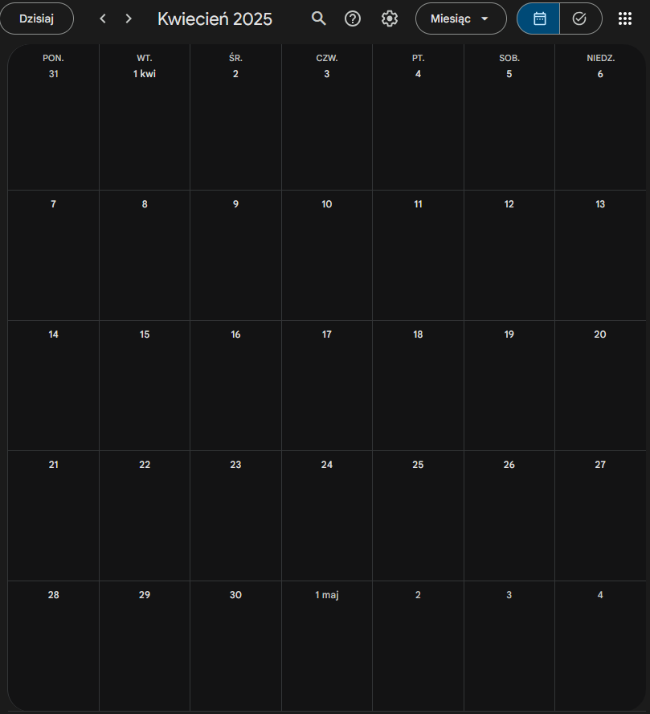
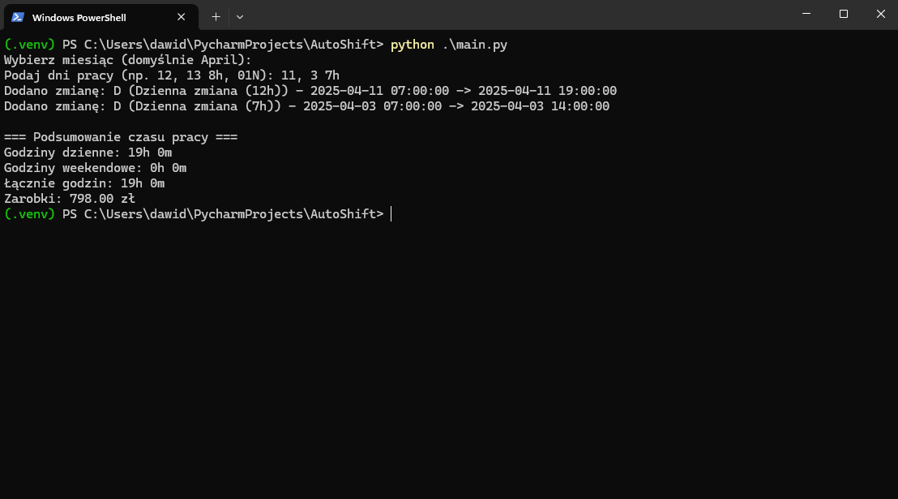
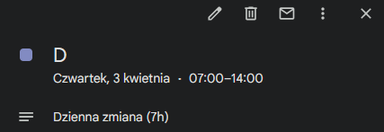
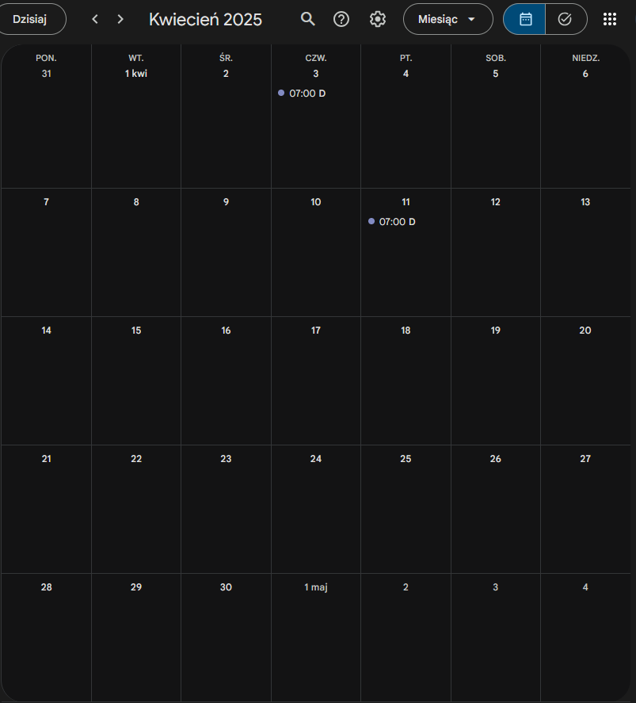

# 📅 Automatyczne dodawanie zmian do Google Calendar  
## 📌 Opis

Ten program pozwala automatycznie dodawać zmiany do Google Calendar na podstawie podanych dni pracy. Obsługuje zmiany dzienne i nocne oraz umożliwia konfigurację godzin rozpoczęcia zmian.

## Wymagania  
* `Python 3.x`
* Konto Google z dostępem do Google Calendar
* API Google Calendar skonfigurowane w Google Cloud
* Plik `credentials.json` z Google Cloud (instrukcja poniżej)
* `calendarId` zapisany w pliku konfiguracyjnym

---

## 📥 Instalacja

### 1. Klonowanie repozytorium:
```bash
git clone https://github.com/DawidKa00/AutoShift.git
cd AutoShift
```
### 2. Instalacja wymaganych bibliotek:
```bash
pip install -r requirements.txt  
```
### 3. Pobranie pliku `credentials.json`:

* Przejdź na stronę [Google Cloud Console](https://console.cloud.google.com/)
* Utwórz nowy projekt i włącz **Google Calendar API**
* W sekcji **API & Services > Credentials** utwórz **OAuth 2.0 Client ID**
* Pobierz plik `credentials.json` i umieść go w katalogu projektu

### 4. Dodanie `calendarId`:
* Otwórz Google Calendar
* Przejdź do **Ustawienia** → **Twoje kalendarze**
* Skopiuj **ID kalendarza** i wklej go po uruchomieniu programu
* Można go zmienić w pliku `settings.json`:
```json
{
    "calendar_id": "123example321@group.calendar.google.com",
    "default_shift_duration": {
        "hours": 12,
        "minutes": 0,
        "total_minutes": 720
    },
    "default_shift": "D",
    "shift_start": {
        "day": {
            "hour": 7,
            "minute": 0
        },
        "night": {
            "hour": 19,
            "minute": 0
        }
    },
    "hourly_rate": "30"
}
```

## 🎯 Jak używać?
1. Uruchom skrypt:
```bash
python main.py
```
2. Podaj dni pracy (np. `12, 15N 10h, 20` oznacza 12-go zmianę standardową, 15-go nocną 10-godzinną, 20-go standardową).
3. Skrypt automatycznie doda wydarzenia do Google Calendar.
## 🖼️ Przykładowe zrzuty






## 🔧 Konfiguracja
Plik `settings.json` pozwala dostosować ustawienia, np. domyślną długość zmiany czy godzinę rozpoczęcia.

## 📜 Licencja
Projekt jest dostępny na licencji MIT.